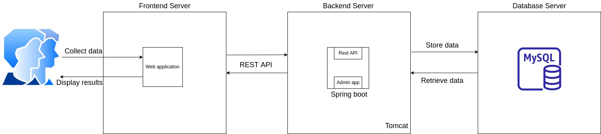
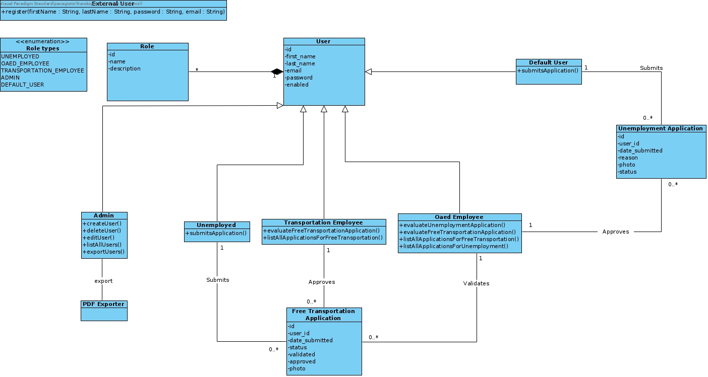
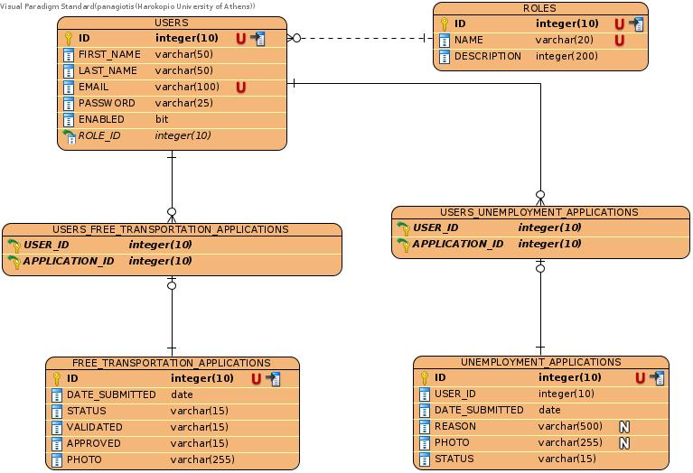
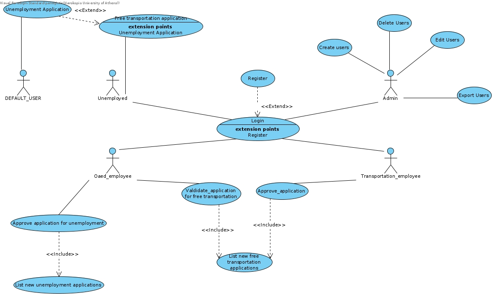
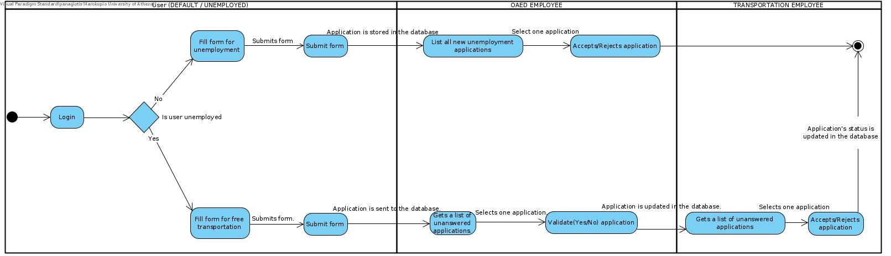
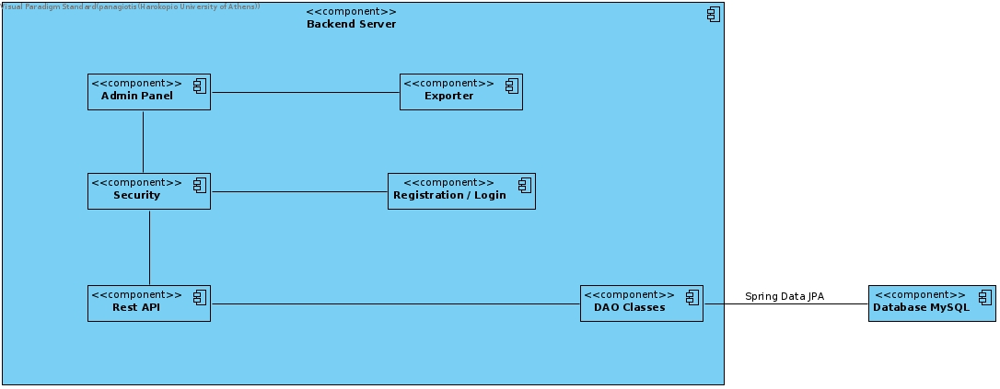

# Distributed-Systems


## Analysis

### System Architecture



### Class Diagram



### ER Diagram



### Use Case Diagram



### Activity Diagram



### Component Diagram




## Database setup

Run this script to create tables and insert some starting data. To be able to run this script you must have downloaded the project and be in the project's home directory.

Run as admin with:
```
sudo mysql < SQL/create_and_insert_data.sql 
```

OR

run as user with:
```
mysql -u $USER -p < SQL/create_and_insert_data.sql
```


After this you are going to have the database schema created and some data in the tables.

